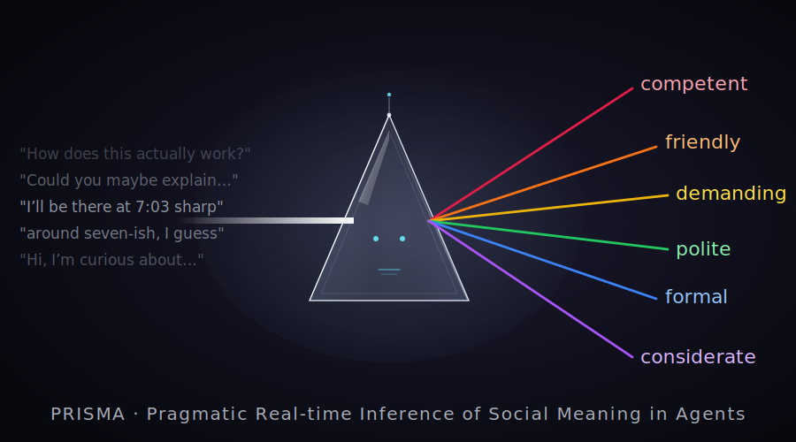

# prisma-chatbot

> *Have you ever wondered what your chatbot thinks about you?*

<p align="center">
  
</p>

**PRISMA** — **P**ragmatic **R**eal-time **I**nference of **S**ocial **M**eaning in **A**gents — is a conversational demo that flips the usual chatbot dynamic: while you talk to *Prisma*, she also forms impressions of you based on how you write. As the conversation unfolds, her assessment updates turn by turn. You can open the impressions panel at any time to see her current view — and scroll back to see how it evolved.

This project is a research-facing artifact accompanying published work on LLM social perception (CMCL 2026; EMNLP 2026, under review).

**Live demo:** [huggingface.co/spaces/RolandM/prisma-chatbot](https://huggingface.co/spaces/RolandM/prisma-chatbot)

**Research papers:** [CMCL 2026 (arXiv)](https://arxiv.org/abs/2604.02512) · EMNLP 2026 — under review

---

## What this is

A Gradio app running on Hugging Face Spaces, powered by GPT-OSS 120B served via Groq. On every turn, the model produces both a conversational response and an evaluation of the user across six social-perception dimensions. Evaluations are stored per turn, so the temporal trajectory of Prisma's impression is preserved and inspectable.

### The six dimensions (v1)

The default attribute set is:

- **competent**
- **likeable**
- **considerate**
- **polite**
- **formal**
- **demanding**

Each is rated 1–7, displayed with both a numeric score and a verbal intensifier — for example, *quite polite (5/7)* or *barely demanding (2/7)*. A future version will let users customize the dimensions from an extended list.

### Design principles

- **Implicit evaluation.** Prisma's response and her evaluation are kept separate. Her replies stay clean and conversational; the evaluation surfaces only when you open the impressions panel.
- **General prompting.** Prisma is not told *what* to attend to. The instruction mirrors the experimental paradigm: *"based on what the user has said, rate them on the following dimensions."* This tests whether the model has internalized human-like inductive biases for social perception, rather than steering it toward a particular cue.
- **Running evaluation.** Each turn updates the impression based on the full conversation so far. Users can scrub back through past turns to see how Prisma's view of them shifted as they wrote more.

---

## What this is not

- Not a production chatbot — it is a research demo with a specific thesis.
- Not a generic LLM wrapper — the dual-role evaluation is the point.
- Not a psychological assessment tool — the evaluation is playful, not diagnostic.

---

## Research context

The project is grounded in ongoing work investigating whether LLMs evaluate speakers based on linguistic choices in ways comparable to human listeners. Does *"I'll be there at 7:03"* vs. *"around 7"* shift perceived competence or pedantry? Does formal phrasing read as more competent regardless of content? The CMCL 2026 paper calibrates several open-source models on a battery of such pragmatic and sociolinguistic tasks; the EMNLP 2026 submission extends this to controlled experimental designs on speaker motive attribution.

Prisma takes this research and makes it interactive: rather than aggregating model judgments across thousands of stimuli, it surfaces a single model's running social perception in real time, for a real user.

---

## Tech stack

- Python 3.11+
- [Gradio](https://www.gradio.app/) — UI framework
- [Groq](https://console.groq.com/docs) — model serving
- [GPT-OSS 120B](https://console.groq.com/docs/openai-models) (`openai/gpt-oss-120b`) — base model

---

## Local setup

```bash
git clone https://github.com/muehlenbernd/prisma-chatbot.git
cd prisma-chatbot
python -m venv .venv
source .venv/bin/activate          # macOS/Linux
pip install -r requirements.txt
cp .env.example .env
# Edit .env: add your GROQ_API_KEY
python app.py
```

You'll need a Groq account; create an API key at [console.groq.com/keys](https://console.groq.com/keys).

---

## Repository structure

```
prisma-chatbot/
├── app.py                 # Gradio app entry point
├── src/
│   ├── prompt.py          # System prompt construction
│   ├── inference.py       # Groq Inference API client wrapper
│   ├── evaluation.py      # Score parsing, validation, formatting
│   └── config.py          # Default attributes, constants
├── scripts/
│   └── test_prompt.py     # Smoke-test harness for the system prompt
├── tests/                 # Pytest unit tests
├── assets/                # UI copy, figures
├── CLAUDE.md              # Instructions for AI coding assistants
├── ARCHITECTURE.md        # Design rationale
└── ROADMAP.md             # Milestones and future work
```

---

## Roadmap

**v1** (current): GPT-OSS 120B (`openai/gpt-oss-120b`) via Groq with strict JSON schema output, six fixed default attributes, always-visible impressions panel (colored bar cells + trajectory plot) with per-turn navigation, 12-turn session cap, per-IP daily session limit.

**v2** (planned):
- Attribute customization: users select up to 6 dimensions from an extended list (~15–20 options including *knowledgeable*, *well-prepared*, *pedantic*, *pushy*, *helpful*, *warm*, *arrogant*, *evasive*, ...)
- Compare-models mode: same conversation, side-by-side perceptions by different models

See [ROADMAP.md](ROADMAP.md) for details.

---

## License

[MIT](LICENSE)

---

## Acknowledgments

Built as a research-dissemination artifact and portfolio project.

> Note: PRISMA / prisma-chatbot is unrelated to the [Prisma ORM](https://www.prisma.io/) or the Prisma photo app of the same name.
